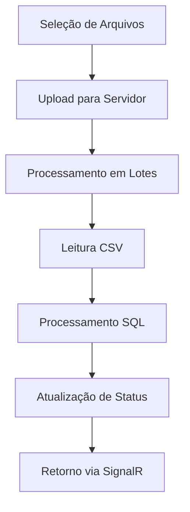
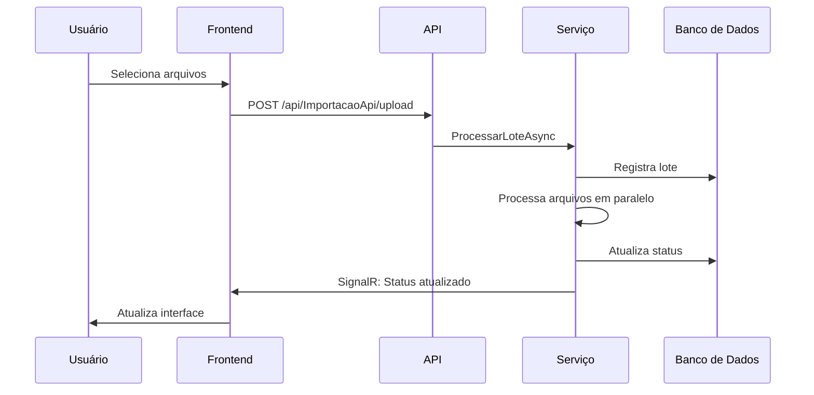
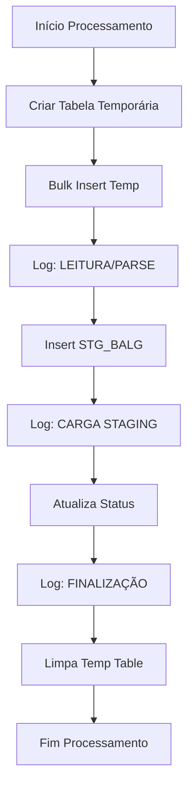
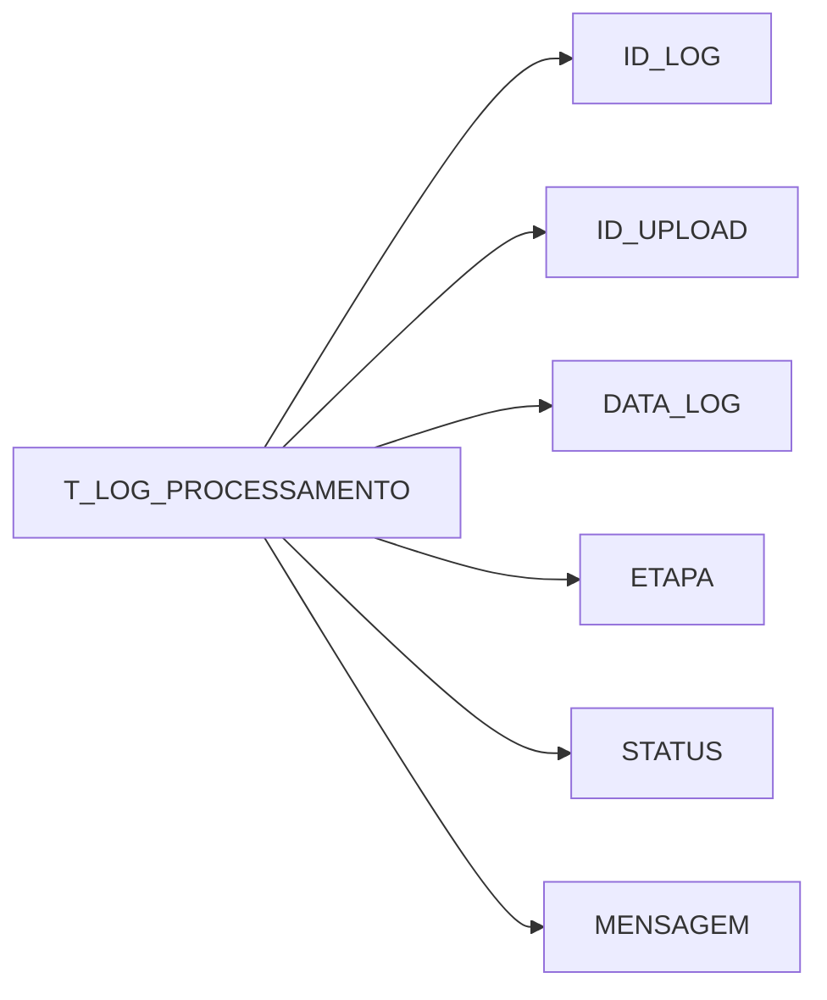
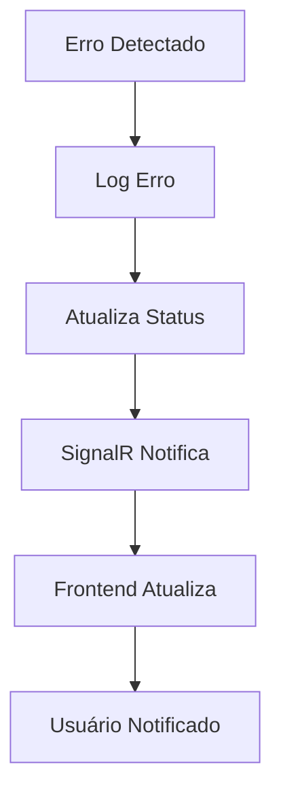

# Fluxo de Processamento de Importação BALG

## Visão Geral do Processo

## Detalhamento das Etapas

### 1. Interface do Usuário
- **Tela de Upload**
  - Seleção múltipla de arquivos
  - Botão de upload
  - Tabelas de visualização de status
    - Tabela de Lotes
    - Tabela de Arquivos

### 2. Upload e Processamento Inicial

### 3. Processamento de Arquivo Individual

### 4. Logs e Status

## Etapas de Processamento

### 1. Upload e Validação
- Frontend envia arquivos via FormData
- API recebe e valida arquivos
- Cria registro de lote no banco
- Inicia processamento assíncrono

### 2. Leitura CSV
- Detecta layout automaticamente
- Lê arquivo em chunks
- Converte dados para DataTable
- Valida estrutura e tipos

### 3. Processamento SQL
- Cria tabela temporária única
- Bulk insert dos dados
- Log: "LEITURA/PARSE CSV APP"
- Insert na STG_BALG
- Log: "CARGA STAGING"
- Atualiza status do upload
- Log: "FINALIZAÇÃO"

### 4. Atualização de Status
- SignalR envia atualizações em tempo real
- Frontend atualiza tabelas
- Logs são registrados no banco
- Status final é atualizado

## Tabelas Envolvidas

### UPLOAD_ARQUIVOS
- ID_UPLOAD
- NOME_ARQUIVO
- STATUS
- DT_INICIO
- DT_FIM
- MENSAGEM_ERRO

### T_LOG_PROCESSAMENTO
- ID_LOG
- ID_UPLOAD
- DATA_LOG
- ETAPA
- STATUS
- MENSAGEM

### STG_BALG
- C_ID_UPLOAD
- NOME_ARQUIVO
- D_BASE
- CD_EMP
- CD_CONTA
- PRZ
- MOE
- SLD
- FLAG_ERRO
- MENSAGEM_ERRO
- DT_IMPORTACAO

## Tratamento de Erros

### Níveis de Tratamento
1. **Frontend**
   - Validação de arquivos
   - Feedback visual
   - Modal de erro

2. **Backend**
   - Validação de dados
   - Logs detalhados
   - Rollback em caso de erro

3. **Banco de Dados**
   - Logs de processamento
   - Status de erro
   - Mensagens detalhadas

### Fluxo de Erro

## Melhores Práticas Implementadas

1. **Performance**
   - Processamento em lotes
   - Tabelas temporárias
   - Bulk insert otimizado

2. **Confiabilidade**
   - Logs detalhados
   - Tratamento de erros
   - Rollback automático

3. **Usabilidade**
   - Feedback em tempo real
   - Interface responsiva
   - Mensagens claras

4. **Manutenibilidade**
   - Código modular
   - Logs estruturados
   - Documentação clara 